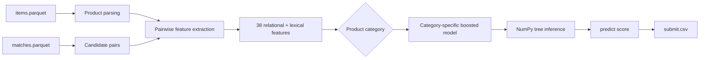
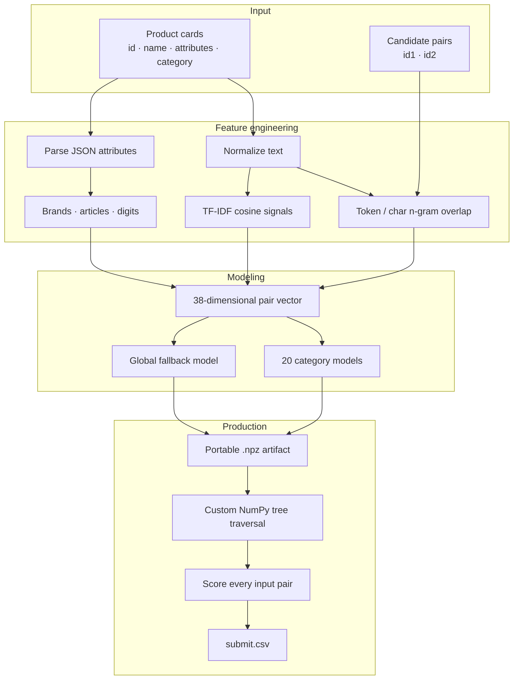

<div align="center">

# E-CUP 2026 · Ozon Merchandise Matching

### Fast category-aware product matching for marketplace deduplication

**365K labeled pairs · 711K products · 20 categories · Macro PR-AUC · container-ready inference**

[](https://www.python.org/)
[](https://numpy.org/)
[](https://scikit-learn.org/)
[](https://www.docker.com/)

**[E-CUP 2026](#competition-context) · [Approach](#solution) · [Results](#results) · [Architecture](#architecture) · [Run](#quick-start)**

</div>

---

## Project overview

This repository contains my solution for the **E-CUP 2026 Ozon Merchandise Matching** competition.

The task is to decide whether two marketplace product cards represent the **same physical product**, using textual information from their names and attributes. Candidate pairs are already retrieved, so the core problem is a hard **binary matching / reranking** task with many lexically similar negative examples.

The final solution is intentionally optimized not only for metric quality, but also for the competition's strict runtime constraints. It uses **category-specific gradient boosting models**, a compact set of pairwise lexical and structured features, and a custom **NumPy-only inference engine** that does not depend on `sklearn` model serialization at runtime.

> The key engineering goal was to move from a simple similarity baseline to a fast supervised matcher that can distinguish hard negatives while remaining small, portable and deterministic.

---

## Why this problem matters

Duplicate product cards create several marketplace problems:

- users see multiple cards for the same item;
- search and recommendations become noisier;
- reviews and sales statistics are fragmented;
- assortment analytics become less reliable;
- downstream ranking systems waste capacity on duplicates.

A production matching system therefore needs two properties at the same time: **high precision on hard candidate pairs** and **fast inference over hundreds of thousands of pairs**.

---

## Competition context

The E-CUP task contains more than **13 million products** across **20 categories** and more than **11 million labeled candidate pairs** from several labeling sources. The official metric is **Macro Averaged PR-AUC**, calculated independently for each category and then averaged.

The solution is executed inside an isolated Docker environment without internet access. Official limits include approximately:

| Stage | Pairs | Time limit |
|---|---:|---:|
| Check | 1,000 | 60 s |
| Public | ~115,000 | 360 s |
| Private | ~275,000 | 780 s |

For model development in this repository, the verified human-labeled subset contains **365,654 pairs**, **711,304 unique products** and all **20 categories**.

---

## Solution

The current production method is `boosted`.

Instead of comparing only raw text embeddings, the model explicitly describes the **relationship between two product cards**. For every pair, the pipeline extracts signals such as:

- exact and fuzzy overlap of product names;
- word-level Jaccard, Dice and containment scores;
- character 3-gram overlap;
- attribute-key overlap;
- exact and conflicting values for shared attributes;
- brand agreement / disagreement;
- article, SKU and model-number overlap;
- numeric-token agreement;
- TF-IDF cosine similarity for full card text;
- TF-IDF cosine similarity for product names.

This produces **38 pairwise features**. Separate `HistGradientBoostingClassifier` models are trained for every category, plus a global fallback model.



### Why category-specific models?

The meaning of similarity differs strongly between product types. A digit mismatch may be critical for electronics or spare parts, while size, color or material conflicts matter differently for apparel, furniture or pharmacy products.

Training an independent model for each category lets the classifier learn these different decision boundaries without requiring a much heavier universal model.

---

## From baseline to final approach

One of the most important parts of this project was not the final estimator itself, but the sequence of experiments that led to it.

| Version | Method | Validation / result | Main conclusion |
|---|---|---:|---|
| v1 | Word TF-IDF cosine | Local Macro PR-AUC **0.3197** | fast, but weak on hard negatives |
| v2 | TF-IDF + char n-grams + E5 embeddings | best direct blend ~**0.3522** on 20K sample | semantic similarity alone does not solve matching |
| v3 | Category-aware logistic regression | **0.5407** random holdout | supervised pair features give a large gain |
| v4 | Category-aware gradient boosting | **0.5758** random holdout | nonlinear interactions improve matching further |

The direct embedding experiment was especially useful: semantic similarity did **not** outperform the lexical baseline. This showed that the difficult part of the task is not retrieving semantically related products, but recognizing subtle contradictions between already-similar candidates.

That changed the project direction from "better embeddings" to **supervised relational features + hard-negative classification**.

---

## Results

### Robust validation

To avoid relying on one optimistic random split, the models were evaluated using three validation strategies:

| Validation split | Category LogReg | Category Boosting |
|---|---:|---:|
| Random stratified | 0.540709 | **0.575826** |
| ID-tail | 0.536861 | **0.569931** |
| Name-group | 0.538866 | **0.570381** |

The similar scores across all three protocols suggest that the gain is not explained by a trivial item-ID or duplicated-name leakage pattern.

### Verified leaderboard iteration

The category-aware logistic version achieved a verified leaderboard score of **0.2294976**, compared with **0.2047051** for the earlier TF-IDF submission, an improvement of about **12.1% relative**.

The boosted v4 model is the current repository default. Its local validation is stronger, but a corresponding leaderboard score is not recorded in the repository, so it is intentionally not claimed here.

### Runtime

A full local emulation of the official container pipeline with the boosted solution produced:

| Stage | Pairs | Local runtime | Competition limit | Status |
|---|---:|---:|---:|---|
| Check | 1,000 | 1.7 s | 60 s | ✅ |
| Public | 115,000 | 60.2 s | 360 s | ✅ |
| Private | 275,000 | 190.8 s | 780 s | ✅ |

These measurements were obtained on a local Mac, not on the official 20-CPU/H100 environment, and are therefore used as an engineering sanity check rather than an official benchmark.

---

## Architecture



### Portable inference

A deliberate design decision is that training and production inference are separated.

Training uses `scikit-learn`, but the fitted gradient boosting trees are exported into a compressed `.npz` artifact. At runtime, tree traversal is implemented manually with NumPy.

Benefits:

- no `joblib` / pickle compatibility issues;
- no dependency on a specific sklearn version at inference time;
- small model artifact: about **1.96 MiB** for the boosted matcher;
- deterministic offline execution;
- easier container portability.

The custom runtime was checked against sklearn's decision function on 1,000 rows with a maximum numerical difference of approximately **3.5e-6**.

---

## Data flow

The competition input consists of two parquet files:

```text
items.parquet
├── id
├── name
├── attributes
└── category

matches.parquet
├── id1
└── id2
```

Training pairs additionally contain:

```text
target ∈ {0, 1}
```

The output contract is preserved exactly:

```csv
id1,id2,predict
123,456,1.7342
789,1011,-0.4831
```

The pipeline guarantees one numeric prediction for **every input pair** and preserves the original pair order.

---

## Quick start

### 1. Clone the repository

```bash
git clone https://github.com/Povasin/E-CUP-OZON-Merchandise-matching.git
cd E-CUP-OZON-Merchandise-matching
```

### 2. Install development dependencies

```bash
python -m venv .venv
source .venv/bin/activate       # Linux / macOS
# .venv\Scripts\activate        # Windows

pip install -r requirements-dev.txt
```

### 3. Run inference

```bash
python -u run.py \
  --items_path items.parquet \
  --matches_path matches.parquet \
  --output_path submit.csv
```

The default method is:

```text
MATCH_METHOD=boosted
```

Alternative experimental modes are still available:

```bash
MATCH_METHOD=supervised python -u run.py ...
MATCH_METHOD=tfidf python -u run.py ...
MATCH_METHOD=tfidf_wc python -u run.py ...
MATCH_METHOD=embed python -u run.py ...
```

`embed` requires the optional PyTorch / sentence-transformers dependencies and model weights.

---

## Training

### Category-aware logistic regression

```bash
python -m src.train_model \
  --items assets/items_human.parquet \
  --matches assets/matches.parquet \
  --feature-cache output/pair_features_v3.npy \
  --validation-split name-group
```

### Category-aware gradient boosting

```bash
python -m src.train_boost \
  --items assets/items_human.parquet \
  --matches assets/matches.parquet \
  --feature-cache output/pair_features_v3.npy \
  --output models/pair_boost.npz
```

Default boosted configuration:

```text
250 boosting iterations
31 max leaf nodes
min_samples_leaf = 40
L2 regularization = 2.0
learning_rate = 0.05
```

---

## Local evaluation

The competition metric is Macro PR-AUC over 20 categories.

For the lightweight TF-IDF experiments:

```bash
python -m src.local_eval --sample 60000
```

For supervised validation, use:

```bash
python -m src.train_model --validation-split random --skip-refit
python -m src.train_model --validation-split id-tail --skip-refit
python -m src.train_model --validation-split name-group --skip-refit
```

To emulate the competition's execution and output-validation stages:

```bash
python -m src.emulate_run --stage all
```

This checks runtime limits, schema, prediction count, duplicates and NaN / Inf values.

---

## Repository structure

```text
.
├── run.py                    # competition entry point
├── metadata.json             # Docker image + entry point
├── models/
│   ├── pair_boost.npz        # current boosted model (~1.96 MiB)
│   └── pair_logreg.npz       # lightweight supervised fallback
├── src/
│   ├── data.py               # parquet loading and text construction
│   ├── features.py           # relational pair features
│   ├── scoring.py            # TF-IDF / embedding baselines
│   ├── model.py              # portable NumPy inference
│   ├── train_model.py        # category-aware logistic training
│   ├── train_boost.py        # category-aware boosting training
│   ├── local_eval.py         # Macro PR-AUC evaluation
│   ├── emulate_run.py        # official-run emulator
│   └── metrics.py            # competition metric
└── docs/
    ├── PROGRESS.md           # experiment log and measurements
    ├── PLAN.md
    ├── RULES.md
    └── ASSETS.md
```

---

## Engineering decisions

### 1. Pair features instead of product memorization

The test set contains unseen products. Features therefore describe the **relationship between the two cards**, not concrete product IDs.

### 2. Hard-negative mindset

Candidate pairs come from a retrieval stage, so negatives are already similar. Pure cosine similarity is therefore insufficient. Explicit contradiction features such as different articles, brands, numbers or shared-attribute conflicts are important.

### 3. Category-aware modeling

Twenty categories have different matching logic. Independent estimators are cheap enough and consistently outperform one global linear model.

### 4. Runtime is part of model quality

The competition gives speed a high weight. The solution avoids a heavy neural model in the final production path and keeps the inference artifact compact.

### 5. Validation beyond random holdout

`random`, `id-tail` and `name-group` splits were used to test whether local gains survive different distribution shifts and duplicated-name patterns.

---

## What I would improve next

The current repository demonstrates a strong lightweight matching pipeline, but several directions remain open:

- mine harder false positives / false negatives per category;
- add category-specific feature sets for high-error verticals;
- evaluate calibrated blends of boosting and a compact cross-encoder;
- use the large weakly labeled set with noise-aware training;
- perform adversarial validation between local and competition distributions;
- profile and vectorize the remaining Python feature-extraction bottlenecks.

The largest unresolved issue is the gap between local holdout quality and the public leaderboard distribution. The repository explicitly records that gap instead of presenting local validation as an official competition result.

---

## Tech stack

`Python` · `NumPy` · `pandas` · `scikit-learn` · `SciPy` · `TF-IDF` · `Gradient Boosting` · `Product Matching` · `Information Retrieval` · `Docker` · `Parquet`

---

## Author

**Kirill Povasin**

GitHub: [@Povasin](https://github.com/Povasin)

---

<div align="center">

**Product cards → relational features → category-aware matching → fast offline inference**

</div>
